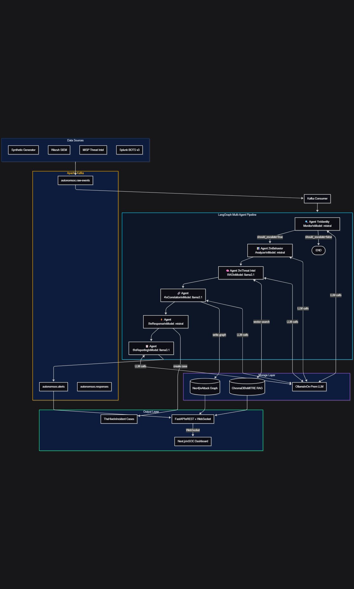

# 🛡️  GhostHunterSOC: Autonomous NHI Threat Detection and Response
## Agentic AI-Powered Autonomous Security Operations Center
### TCS-Amex GenAI Hackathon 2026 · Cybersecurity Track

---

## ❓ Synthetic Data vs Real Datasets — Which Should You Use?

| Dataset | Pros | Cons | Best For |
|---|---|---|---|
| **Synthetic (default)** | Instant, controllable attack scenarios, CIM-format | Not real attack patterns | Demos, fast iteration |
| **Splunk BOTS v3** | Real APT28 attacks, realistic multi-stage | Requires Splunk BOTS environment to export | Production-like testing |
| **Microsoft MSTIC GUIDE** | Labeled TP/FP/BP incidents, MITRE mapped | Enterprise Azure focus, no NHI-specific | ML triage model training |
| **Awesome-Security-Datasets** | Variety of PCAPs, logs, malware samples | Needs normalization, no IAM focus | Research/exploration |
| **Graylog Open** | Real syslog/audit format | Not IAM-specific | Infrastructure log testing |
| **Wazuh Live** | Real alerts from your own endpoints | Requires deployed Wazuh agents | True production use |
| **MISP Live** | Real IOC feeds (CIRCL, Abuse.ch) | Requires MISP deployment | Threat intel enrichment |

### 🎯 Recommendation for Hackathon:
- **Demo day**: Use **synthetic** — full control, no setup, guaranteed attack scenarios
- **Judges ask about data**: Run **BOTS v3 adapter** — shows real APT pattern knowledge
- **Production POC**: Use **Wazuh + MISP live** — real enterprise integration

---

## 🏗️ Full Architecture

```
┌─────────────────────────────────────────────────────────────────────┐
│  DATA SOURCES                                                       │
│  Splunk BOTS · Wazuh · MISP · MSTIC · Synthetic Generator           │
└──────────────────────────┬──────────────────────────────────────────┘
                           │
                    Apache Kafka
              (autonomsoc.iam / .nhi / .wazuh)
                           │
┌──────────────────────────▼──────────────────────────────────────────┐
│  LANGGRAPH ORCHESTRATOR                                             │
│                                                                     │
│  [Identity Monitor] → [Behavior Analyzer] → [Threat Intel RAG]      │
│                    → [Correlation Agent]  → [Response Agent]        │
│                    → [Reporting Agent]                              │
└──────────────────────────┬──────────────────────────────────────────┘
                           │
          ┌────────────────┴────────────────┐
          │                                 │
    Neo4j Graph DB                    TheHive / Shuffle
    (Attack Graph)                    (Incident Response)
          │
    FastAPI REST + WebSocket
          │
    React SOC Dashboard
```

---

## 🚀 Quick Start (One Command)

```bash
# Clone and start everything
git clone https://github.com/your-org/GhostHunterSOC
cd GhostHunterSOC

# 1. Pull Ollama models (one time)
set OLLAMA_HOST="https://localhost:11435"
ollama pull llama3.1
ollama pull mistral
ollama serve
```

Use one startup path. Docker Compose already starts the API and dashboard, so do not also run `uvicorn` and `npm start` on ports 8000/3000 at the same time.

# 2A. Start full Docker Compose stack
```bash
docker-compose -f docker/docker-compose.yml build
docker-compose -f docker/docker-compose.yml up -d
```

# 2B. Or run local API and dashboard instead of Docker Compose
```bash
python -m venv .venv
.venv\Scripts\activate
pip install -r requirements.txt
python data/synthetic_generator.py --events 500 --attack all
python -c "from mitre.mitre_engine import MITREEngine; MITREEngine()"
```

# 4. In another terminal — start API
```bash
uvicorn api.api:app --port 8000
```
or 
```bash
python -m uvicorn api.api:app --port 8000
```

# 5. Start React dashboard
```bash
cd react-dashboard && npm install && npm start
```

# Agent Architecture

```

```

### Services after startup:
| Service | URL |
|---|---|
| React Dashboard | http://localhost:3000 |
| API + Swagger | http://localhost:8000/docs |
| Neo4j Browser | http://localhost:7474 |
| Kafka UI | http://localhost:8090 |
| TheHive | http://localhost:9000 |
| ChromaDB | http://localhost:8001 |

---

## � SOC Tool Integration Guide

### Wazuh (Open Source SIEM/XDR)
```bash
# Deploy Wazuh Manager
docker run -d --name wazuh wazuh/wazuh-manager:4.7.3 -p 55000:55000

# Feed Wazuh alerts into AutonomSOC
python kafka/kafka_producer.py --mode wazuh \
  --wazuh-url http://localhost:55000 \
  --wazuh-user wazuh --wazuh-pass wazuh
```
**What it adds**: Real endpoint alerts, file integrity monitoring, vulnerability detection

### MISP (Threat Intelligence)
```bash
# Deploy MISP
docker-compose up misp

# Feed IOCs into ChromaDB + Kafka
python kafka/kafka_producer.py --mode misp \
  --misp-url https://localhost:8443 \
  --misp-key YOUR_API_KEY
```
**What it adds**: Real IOC enrichment from CIRCL, Abuse.ch, and custom feeds

### TheHive (Incident Response)
```bash
# Set API key in .env
THEHIVE_KEY=your-key-here

# Cases auto-created for CRITICAL/HIGH incidents
# View at http://localhost:9000
```
**What it adds**: Case management, analyst assignment, evidence collection

### Shuffle SOAR (Workflow Automation)
```bash
# Access Shuffle UI at http://localhost:5001
# Import AutonomSOC playbooks from shuffle-apps/
```
**What it adds**: Visual playbook editor, 3rd-party integrations (Slack, Jira, PagerDuty)

---

## 📊 Using Real Datasets

### Option 1: Splunk BOTS v3
```bash
# Download from: https://github.com/splunk/botsv3
# Export from Splunk: index=botsv3 | outputcsv bots.json
python kafka/kafka_producer.py --mode bots --dataset /path/to/bots.json
```

### Option 2: Microsoft MSTIC GUIDE
```bash
# Download from: https://github.com/microsoft/mstic
# File: GUIDE_Train.csv
python kafka/kafka_producer.py --mode mstic --dataset /path/to/GUIDE_Train.csv
```

### Option 3: Awesome-Security-Datasets
```bash
# Browse: https://github.com/shramos/Awesome-Cybersecurity-Datasets
# Many are PCAP — use tshark to convert to JSON, then use raw adapter
python kafka/kafka_producer.py --mode simulate  # default while normalizing
```

---

## 📁 Project Structure

```
autonomsoc/
├── data/
│   └── synthetic_generator.py     # Splunk CIM IAM/NHI log generator
├── agents/
│   └── agent_pipeline.py          # LangGraph 6-agent pipeline
├── kafka/
│   ├── kafka_producer.py          # Multi-source event producer
│   └── kafka_consumer.py          # Pipeline consumer + TheHive integration
├── neo4j/
│   └── neo4j_graph.py             # Attack graph engine
├── mitre/
│   └── mitre_engine.py            # MITRE ATT&CK mapping + ChromaDB RAG
├── api/
│   └── api.py                     # FastAPI REST + WebSocket
├── react-dashboard/
│   ├── src/
│   │   ├── App.jsx                # Router + sidebar + WebSocket
│   │   ├── pages/
│   │   │   ├── Dashboard.jsx      # Live SOC overview
│   │   │   ├── Incidents.jsx      # Incident list + filter
│   │   │   ├── IncidentDetail.jsx # Full case view + report
│   │   │   ├── AttackGraph.jsx    # Neo4j force-layout visualization
│   │   │   ├── Analysis.jsx       # Run events through pipeline
│   │   │   └── MITREMap.jsx       # MITRE technique browser
│   │   └── store/
│   │       └── alertStore.js      # Zustand live alert store
│   └── package.json
├── docker/
│   ├── docker-compose.yml         # Full 12-service enterprise stack
│   ├── Dockerfile.agents          # Python agents + API
│   ├── Dockerfile.dashboard       # React + Nginx
│   └── nginx.conf
├── k8s/
│   └── manifests.yaml             # Full K8s deployment + HPA + Ingress
├── .github/
│   └── workflows/
│       └── ci-cd.yml              # GitHub Actions CI/CD
├── devpost/
│   └── SUBMISSION.md              # Full Devpost submission text
├── requirements.txt
├── .env.example
└── README.md
```

---

## 👥 Team Roles

| Role | Owner | Key Deliverables |
|---|---|---|
| Tech Lead + Architect | You (9yr Security + AI) | Agent design, MITRE mapping, attack scenarios, LLM prompts |
| AI / ML Engineer | ML person | LangGraph orchestration, Ollama, ChromaDB RAG |
| Security Analyst | Security person | Synthetic data realism, playbook logic, MITRE accuracy |
| Full Stack Dev | Both-skills person | React dashboard, FastAPI, Neo4j, Docker, demo polish |

---

## 🏆 Hackathon Submission Checklist

- [x] Problem statement defined (IAM/NHI blind spot)
- [x] Business use case (Financial organization Amex-specific: NHI sprawl, payment API protection)
- [x] POC built (all 6 agents functional)
- [x] Demo scenarios ready (3 attack scenarios, <90s containment each)
- [x] MITRE ATT&CK mapped (ChromaDB RAG + rules engine)
- [x] Neo4j attack graph (blast radius visualization)
- [x] React dashboard (5 pages, live WebSocket alerts)
- [x] On-prem LLMs (Ollama — no cloud cost, full data sovereignty)
- [x] SOC tool integrations (Wazuh, MISP, TheHive, Shuffle)
- [x] Docker Compose (12 services, one-command startup)
- [x] Kubernetes manifests (production-ready)
- [x] GitHub Actions CI/CD (build, test, security scan, deploy)
- [x] Devpost submission package
- [x] PowerPoint presentation (14 slides, storytelling flow)
- [x] README complete

---

*Built for TCS-Amex GenAI Hackathon 2026 | Cybersecurity Track | Best POC + Best Design*
