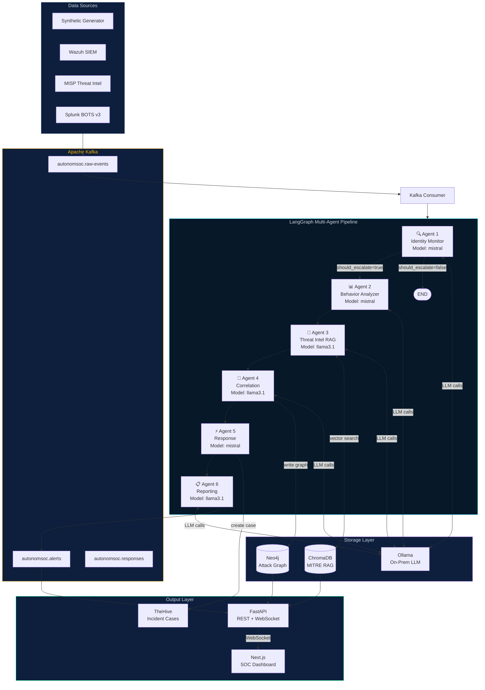
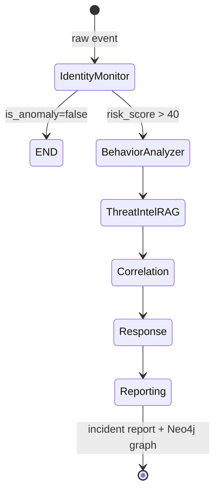

# AutonomSOC — Architecture Diagram

## Full System Architecture (Mermaid)



---

## Agent State Flow



---

## Data Flow: Columns & Features

| Column | Type | Source | Used By |
|---|---|---|---|
| event_id | UUID | Generator | All agents |
| identity_id | string | IAM/NHI logs | Agents 1,2,4 |
| identity_type | enum | IAM logs | Agents 1,5 |
| src_ip | string | Network | Agent 1,2 |
| geo | string | GeoIP | Agent 1 |
| risk_score | float 0-100 | Rule+LLM | Agent 1 |
| bytes_out | int | API logs | Agent 1 |
| mfa_used | bool | Okta | Agent 1 |
| days_since_last_active | int | IAM DB | Agent 1 |
| attack_type | enum | Label | Agents 3,4,5 |
| is_anomaly | bool | Label | Consumer filter |
| mitre_technique | string | LLM/ChromaDB | Agent 3 |
| adjusted_risk_score | float | Agent 1 output | Agents 2-6 |
| behavior_score | float | Agent 2 output | Agent 4 |
| blast_radius | int 0-100 | Agent 4 output | Agent 5,6 |
| attack_narrative | string | Agent 4 LLM | Agent 6 |
| playbooks_executed | list | Agent 5 | Agent 6 |
| final_report | markdown | Agent 6 LLM | API/Dashboard |

---

## Risk Score Calculation (0–100)

```
base_score       = event.risk_score (0-15 normal, 55-96 attack)

anomaly_boost    = count(anomalies_detected) × 12
  Each fires if:
  ANOMALOUS_GEO      → geo in [RU,CN,KP,IR,NG,BR]       → +12
  DORMANT_IDENTITY   → days_inactive > 90                 → +12
  MFA_BYPASS         → mfa_used=False on auth             → +12
  OFF_HOURS_ACCESS   → hour < 6 or hour > 22 UTC          → +12
  LARGE_TRANSFER     → bytes_out > 100,000                → +12
  API_KEY_EXTERNAL   → context=unknown_external           → +12
  SCOPE_CREEP        → total_scopes > 2                   → +12

adjusted_score   = min(base_score + anomaly_boost, 100)
llm_score        = Behavior Analyzer LLM rating (0-100)
final_score      = max(adjusted_score, llm_score)

CRITICAL → score > 80   AUTO-RESPOND
HIGH     → score > 60   AUTO-RESPOND
MEDIUM   → score > 40   HUMAN REVIEW
LOW      → score ≤ 40   LOG ONLY
```
